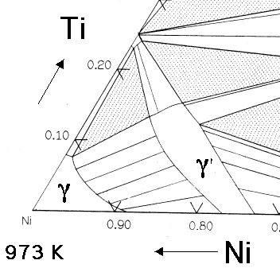

# Chapter 2
# Literature Survey

## Monte Carlo Method

The earliest use of Monte Carlo method was done by Comte de Buffon, to solve the famous Buffon's needle problem. The problem states that given a needle of length $l$, and a surface that has parallel lines separated by a distance $t$, also $ t < l $ what is the probability that if we drop the needle on this surface, it doesn't land on one of the lines.

Laplace[ref:mkmc/3/] remarked that one could determine the value of pi using the solution of this problem. The probability of this event is given by following.$$ P(E)=\frac{2l}{t\pi} $$
Where $E$ is the event that needle doesn't land on the line.

The idea behind Monte Carlo Method is a simple but powerful one. If we did random experiments of dropping a needle as described then, due to the law of large numbers, as the number of experiments, $N$ increases the deviation of probability will grow smaller and as $N \rightarrow \infty $, the relative frequency of success will be $P(E)$.

This a very simple example of Monte Carlo method. In the 1940s the atomic bomb was being developed in Los Almos National Laboratory, United States. Stannis Ulam was one of the scientists working on the project. Ulam has told the story of how he came up with the idea. He was playing solitaire and trying to determine how many permutations have a solution. He was trying to use combinatorics to approach this problem. However he had an epiphany, he asked himself if I were to take a random permutation and see if its solution exists, also if I were to repeat this experiment many and many times, then the relative frequency of success will almost be the true probability, with a few percent error. He discussed this idea with John von Neumann one of the leading mathematicians of the time. At the time computers were an emerging technology, Neumann understood that the random experiments can be simulated on a machine, and as computing power increases the accuracy of the results will increase. He programmed the ENIAC computer to run simulations for quantum mechanical problems which they were struggling to solve at the time. Metropolis et al described the general approach to this in his paper(1949 **_put reference_**).

Monte Carlo method is widely used in computational physics, in option pricing in finance, integration of functions with many variables, etc.

## Mathematics of Monte Carlo method in materials
Here I will try to present a general picture of Monte Carlo method. Consider a system containing $N$ particles. To define the microstate of the system, or state of each particle in the system uniquely we need their positions, $q$ and velocities $\dot{q}$, and a potential that is a function of these $2N$ variables. If we imagine a system that we can see with our naked eye, say one mole of a gas, then it will have $2N_A$ variables in its phase space. We know from statistical mechanics that this phase space will contain all possible states that the system can take. Energy is given by $$ H(q,\dot{q},t) = T(\dot{q}) + V(q,\dot{q},t) $$ This is the general form of Hamiltonian in classical mechanics.

If we know at initial time states of all the atoms then we can apply classical mechanics to get a differential, or possibly a partial differential equation in terms of positions and velocities, that may be solved for a trajectory of the particles. This approach is called Molecular Dynamics approach.

There are two problems with this approach. First is that it is difficult to scale the method for a large number of atoms. Since we need to solve differential equations to get each value at each time step, say we double the number of atoms, then twice the number of differential equations need to be solved to get a solution at each time step. The second problem is that since we can't simulate to longer timescales, properties that reach equilibrium slowly can't be computed using MD simulation.

Monte Carlo method is different from MD. Monte Carlo is a statistical sampling method. MD tries to simulate the process of any microstate reaching equilibrium. However, if equilibrium is all we are interested in then the time-dependent data is useless, as we only want to look at steady state value. In MD simulation we use Newton's laws of motion, so energy can be assumed to conserve. Now if we consider all the points in the $2N$-dimensional phase space, we will only be sampling points at which energy is equal to the desired value. This will cause the valid points to collapse to a surface in $2N$-dimensional phase space. What we have now is called an ensemble. Each of these states will have a probability of occurrence associated with it. This happens because there are multiple microstates that can lead to the same macrostate. If we know which microstates can cause occur in our system, and with what probability then we can find all properties of the system by averaging over the ensemble.

Monte Carlo is sampling technique, not a simulation technique. The simulation has no physical meaning. In MD the steps that we take are in a real coordinate system. On the contrary in Monte Carlo, we move in the phase space. Moves in the phase space can sample a lot of equilibrium configurations, however, each successive step doesn't relate to a physical process. It must be noted that any results generated by MCM should have sufficient data points to be a statistically significant sample.

The first step in any Monte Carlo simulation is picking the ensemble. Ensemble means a collection of all states and their probabilities, that might represent our system. It is very important for the ensemble to reflect the process that we are trying to sample.

In material science, we are interested in the thermodynamics. We have the first law of thermodynamics as, $$dU = TdS-pdV+\sum{\mu_i dN_i}$$
However in statistical mechanics entropy formulation is preferred, which is obtained by simple algebra as $$dS = \frac{1}{T}dU+\frac{p}{T}dV-\frac{1}{T}\sum \mu_i dN_i$$
Various thermodynamic variables occur in pairs like $(S,T), (P,V), (\mu, N)$ etc. These pairs are called conjugate variables. These variables can span the state of the system. At any given time in this project, we will define at 3 of these 6 to be fixed. If we keep temperature, volume, and the number of atoms of each type constant, then such an ensemble is the canonical ensemble. Which has entropy $$dS = \frac{1}{T}dU$$

This will represent our ensemble. We have established that to get any property we must average over an ensemble. So how to use the entropy to sample through the states? It has been established that Hamiltonian of the system $H$ is Legendre Transform of entropy. We must apply appropriate Legendre Transform to get the $H$ in the relevant coordinate system. Now that we have the Hamiltonian we can write a formula for averaging over the ensemble.
The probability of a state '$s$' is given by ->
$$P_s = \frac{\exp{(-\beta H_s)}}{\sum\exp{(-\beta H_s)}}$$
Here $\beta = \frac{1}{k_B T}$ where $k_B$ is the Boltzmann constant, and the denominator is known as the partition function,$Q$. $$Q=\sum\exp{(-\beta H_s)}$$
However the simulation isn't done exactly like this. Next section describes how computer algorithm differs from the one mentioned above.
But it isn't trivial to understand why MC method works. It is trivial to see why MD simulation would give physically relevant results because it simulates a real process. In MC method we have mentioned that the process most of the times won't have a physical meaning. But it still works. This is because of the **Ergodicity Principle**. Ergodicity principle states that given enough time a system will reach all states attainable. This a well-established fact in statistical physics. So since the system will attain all possible states it becomes clear that average over various states will give physically relevant result.

Monte Carlo is a powerful method and although above discussion is in context to material science, for any system if a Hamiltonian can be written then we can apply Monte Carlo to it.

## Embedded Atom Potential
Every material has an internal potential field. This potential is responsible for most of the things that happen in a material. In any molecular simulation technique the energy of the system is determined by this potential field, and maybe some other factors. In olden days(before the 1980s) these potentials were modelled in computer simulations using pairwise potential models. This type of treatment isn't physically correct but was computationally convenient at the time. Finnis-Sinclair[reference] gave a new $N$-body potential method. Although even this isn't completely accurate multiple studies have shown agreement[reference] of this potential to physical experiments.

Finnis-Sinclair described the $N$-body potential as follows.  
$$U_{tot}=U_N + U_P$$
Here $U_N$ is the $N$ body term and $U_P$ is the pairwise potential term. This model belongs to class of emperical and analytical potentials called the bond order potential. Daw and Baskes have develpoed a convinient form of this for realistic metal systems. $$E_{tot}=\frac{1}{2}\sum_{i,j} \phi_{ij}(r_{ij}) + \sum_{i} F_i(\bar{\rho_{i}})$$
where, $$\bar{\rho_i}=\sum_{i \neq j} \rho_i$$
Here $r_{ij}=|r_i-r_j|$, i.e the distance between $i^{th}$ and $j^{th}$ atom, and $\phi_{ij}(r)$ is the pairwise potential function of $i^{th}$ and $j^{th}$ atom. The $\bar{\rho_i}$  is the charge density at $i^{th}$ atom, and $F_i$ is the embedding energy functoins at the $i^{th}$ atom.
So if we are trying to model an A-B solid system then there will be 3 kinds of pairwise interactions, namely $\phi_{AA}$ , $\phi_{AB}$ , $\phi_{BB}$. Electron density due to two atoms, $\rho_A$ , $\rho_B$  and Embedding functions of the two atom, $F_A$ , $F_B$ will present. All these functions are needed to determine bond energies in a binary system.
Had this been a ternary system then we would need 6 pairwise, 3 embedding, and 3 electron densities.$^{[citationNeeded]}$

## Interfacial energies in Al-Ni alloys
This project is concerned with the interfacial free energy of various types of interfaces in Al-Ni alloys. Nickel-based superalloys are of special interest. In my opinion, it is a marvellous example of engineering. As we know when we heat a material it gets softer, which means it deforms more easily. In jet engines, the temperatures can reach up to 1500K, and even more. Under such high temperatures, materials begin to creep. At low temperatures, the dominant deformation mechanism is dislocation movement or plastic deformation. At higher temperature, the driving force needed for movement of these dislocations is reduced, and consequently, load bearing capacity of material weakens. However turbine blades which are made of Ni-Al superalloys don't show this behaviour. In these superalloys presence of $\gamma'$ phase delays the onset of creep.$^{[citationNeeded]}$
When Ni and Al or Ti are present in an alloy at about 80-90% Ni we see the formation of $\gamma'$ and $\gamma$ phases.$^{[citationNeeded]}$ The $\gamma'$ phase is SCC lattice with $\mathrm{Ni_3(Al,Ti)}$ as the motif, and $\gamma$ phase is FCC with Ni.

As we can see that both these unit cells have similar arrangements of atoms. This makes fitting these two lattices along certain orientations possible. The mismatch in the size of the lattice parameter of $\gamma'$ and $\gamma$ phases can be controlled by controlling the concentrations of Al and Ti [[H. K. D. H. Bhadeshia](http://www.msm.cam.ac.uk/phase-trans/2003/Superalloys/superalloys.html)]. If this mismatch is small then the interfaces that form will be coherent interfaces or semi-coherent interfaces. Such interfaces have a lower energy, so they act as extremely good barriers for dislocation movement.

We intend to study interfacial energies of $\gamma'$ and $\gamma$ interface. There are a number of ways to do this.
